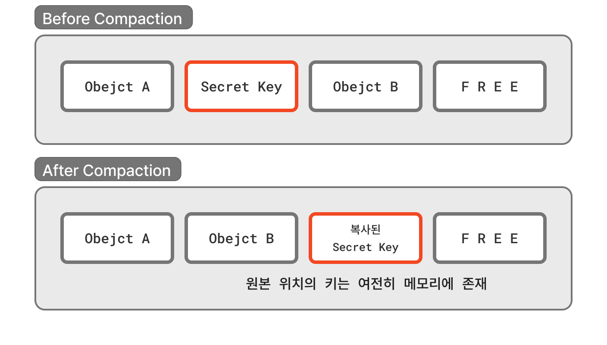
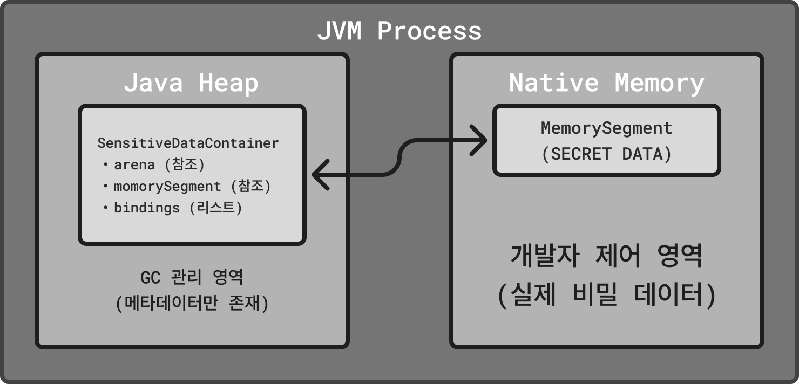

# 얽힘 라이브러리 보안 기술 명세

이 문서는 얽힘 라이브러리가 자신의 철학을 지키기 위해 어떤 보안 알고리즘을 사용하고, 그 알고리즘은 어떻게 수행되는지에 대해 기술한 문서입니다. 라이브러리에 새로운 변화가 생기면 이 문서에 곧바로 반영됩니다.

이 문서에서 자주 언급될 [`entlib-native` 네이티브 라이브러리](https://github.com/Quant-Off/entlib-native/)를 "네이티브"라 하겠습니다. 특별한 경우가 아닌 이상, "네이티브"는 해당 라이브러리를 의미하기로 약속합니다.

## 네이티브와의 상호작용

얽힘 라이브러리는 Java의 [Foreign Function & Memory API(JEP 454)](https://openjdk.org/jeps/454)를 사용하여 Rust로 작성된 `entlib-native` 라이브러리와 통신합니다. 이 절에서는 Java-Rust 간 상호작용의 기술적 세부 사항을 다룹니다.

### 네이티브 라이브러리 링킹

#### NativeLinkerManager

`NativeLinkerManager` 클래스는 네이티브 라이브러리와의 FFI 브릿지를 담당합니다.

```java
// 라이브러리 로딩 및 심볼 검색
this.lookup = SymbolLookup.libraryLookup(lib, Arena.global());
this.linker = Linker.nativeLinker();
```

- `SymbolLookup.libraryLookup()`: 지정된 경로의 네이티브 라이브러리(`.dylib`, `.so`, `.dll`)에서 심볼을 검색합니다.
- `Linker.nativeLinker()`: 플랫폼 네이티브 링커를 획득하여 `C-ABI` 호출을 가능하게 합니다.
- `MethodHandle`: 네이티브 함수에 대한 핸들을 `ConcurrentHashMap`에 캐싱하여 스레드 안전한 접근을 보장합니다.

#### 함수 등록

```java
// InternalFactory.java에서 네이티브 함수 등록
NATIVE = new NativeLinkerManager("entlib_native")
    .addVoidMethodHandle("entanglement_secure_wipe", ValueLayout.ADDRESS, ValueLayout.JAVA_LONG);
```

- `ValueLayout.ADDRESS`: 메모리 세그먼트의 주소를 전달합니다.
- `ValueLayout.JAVA_LONG`: 메모리 세그먼트의 바이트 크기를 전달합니다.

### 메모리 관리

#### Off-Heap 메모리 사용

`SensitiveDataContainer`는 민감한 데이터를 Java Heap 외부(Off-Heap)에 저장합니다. 이를 통해 다음의 보안 이점을 얻습니다.

1. GC에 의한 메모리 재배치(relocation) 방지
2. 메모리 내용의 명시적 제어 가능
3. 네이티브 수준의 안전한 데이터 소거

#### HeuristicArenaFactory

`HeuristicArenaFactory`는 실행 환경을 감지하여 적절한 `Arena` 모드를 자동 선택합니다.

| 모드         | 설명             | 사용 환경                            |
|------------|----------------|----------------------------------|
| `CONFINED` | 생성 스레드만 접근 가능  | 단일 스레드 환경, 보안성 최상                |
| `SHARED`   | 모든 스레드에서 접근 가능 | 비동기/서버 환경 (Netty, Spring Boot 등) |
| `AUTO`     | 환경 자동 감지       | 기본값                              |

환경 감지는 클래스패스에서 다음 프레임워크의 존재를 확인하여 수행됩니다.

- `io.netty.channel.EventLoop` (Netty)
- `org.springframework.boot.SpringApplication` (Spring Boot)
- `org.apache.catalina.startup.Tomcat` (Tomcat)
- `reactor.core.publisher.Flux` (Project Reactor)

#### 계층적 컨테이너 구조

`SensitiveDataContainer`는 연쇄적 구조를 지원합니다. `bindings` 리스트를 통해 하위 컨테이너를 관리하며, 부모 컨테이너가 닫힐 때 모든 하위 컨테이너도 함께 소거됩니다.

```
ParentContainer (Arena)
    ├── ChildContainer 1
    ├── ChildContainer 2
    └── ChildContainer 3
```

### 보안 삭제 (Secure Wipe)

#### Rust 측 구현

```rust
#[unsafe(no_mangle)]
pub extern "C" fn entanglement_secure_wipe(ptr: *mut u8, len: usize) {
    let result = panic::catch_unwind(|| {
        unsafe {
            if let Ok(data) = slice_from_raw_mut(ptr, len) {
                data.zeroize();
            }
        }
    });
    // ...
}
```

- `zeroize` 크레이트를 사용하여 메모리를 0으로 덮어씁니다.
- `panic::catch_unwind`로 Rust 패닉이 JVM으로 전파되는 것을 방지합니다.
- `#[unsafe(no_mangle)]`: C ABI 호환 심볼을 노출합니다.

#### Java 측 호출

```java
InternalFactory.callNativeLib()
    .getHandle("entanglement_secure_wipe")
    .invokeExact(memorySegment, memorySegment.byteSize());
```

### 동시성 처리

`SensitiveDataContainer.close()` 메소드는 3단계로 나뉘어 데드락을 방지합니다.

#### Phase 1: 스냅샷 생성 및 연결 해제

```java
synchronized (bindings) {
    if (!arena.scope().isAlive()) return;
    snapshot = new ArrayList<>(bindings);
    bindings.clear();
}
```

- 락을 획득하여 `bindings` 리스트의 방어적 복사본을 생성합니다.
- 원본 리스트는 즉시 비워 다른 스레드의 접근을 허용합니다.

#### Phase 2: 하위 컨테이너 해제 (Open Call)

```java
for (int i = snapshot.size() - 1; i >= 0; i--) {
    SensitiveDataContainer child = snapshot.get(i);
    child.close();
}
```

- 락 바깥에서 수행하여 자식 컨테이너가 부모를 다시 호출해도 데드락이 발생하지 않습니다.
- 역순으로 순회하여 의존성 순서를 보장합니다.

#### Phase 3: 네이티브 메모리 소거 및 최종 종료

```java
synchronized (bindings) {
    // Phase 2 중 추가된 데이터 처리
    if (!bindings.isEmpty()) { /* 소거 */ }

    if (arena.scope().isAlive()) {
        // Rust Native Wipe 호출
        InternalFactory.callNativeLib()
            .getHandle("entanglement_secure_wipe")
            .invokeExact(memorySegment, memorySegment.byteSize());

        // Java Heap 데이터 소거
        KeyDestroyHelper.zeroing(fromData);
        arena.close();
    }
}
```

- 다시 락을 획득하여 Phase 2 진행 중 추가된 데이터를 확인합니다.
- 네이티브 메모리 소거 후 Arena를 종료합니다.

### 네이티브 헬퍼 함수

`entlib-native`는 다음의 헬퍼 모듈을 제공합니다.

#### unsafe_slice

원시 포인터에서 안전하게 슬라이스를 생성하는 함수들을 제공합니다.

| 함수                   | 설명                    |
|----------------------|-----------------------|
| `bytes_from_raw`     | 원시 포인터에서 `Vec<u8>` 생성 |
| `slice_from_raw_mut` | 원시 포인터에서 가변 슬라이스 생성   |
| `array_from_raw<N>`  | 원시 포인터에서 고정 크기 배열 생성  |

모든 함수는 널 포인터, 길이 0, 오버플로우에 대한 검증을 수행합니다.

#### rng

`ChaCha20Rng` 기반의 암호학적으로 안전한 난수 생성기를 제공합니다.

```rust
pub struct Csprng {
    rng: ChaCha20Rng,
}
```

- `from_os_rng()`: 운영체제 엔트로피 소스로 초기화
- `from_seed()`: 32바이트 시드로 초기화 (결정론적 테스트용)

### 민감 데이터 컨테이너

`SensitiveDataContainer`는 얽힘 라이브러리의 핵심 보안 구성 요소입니다. 이 클래스는 Java 언어의 본질적인 메모리 관리 한계를 극복하고, [Rust의 소유권(ownership) 패러다임](https://doc.rust-kr.org/ch04-01-what-is-ownership.html)을 Java 생태계에 도입하여 민감한 데이터에 대한 완벽한 제어권을 제공합니다.

#### Java 메모리 모델의 한계

Java는 GC(Garbage Collector)를 통한 자동 메모리 관리를 제공하지만, 이는 보안 관점에서 심각한 문제를 야기합니다.

**GC의 보안 취약점**

1. **비결정적 소거**: 객체가 참조를 잃어도 실제 메모리 소거 시점은 GC가 결정합니다. 민감한 데이터(암호화 키, 비밀번호 등)가 메모리에 수 분에서 수 시간까지 잔류할 수 있습니다.

2. **메모리 재배치(Relocation)**: GC의 `Compaction` 단계에서 객체가 새로운 메모리 주소로 복사됩니다. 이 과정에서 원본 위치의 데이터는 단순히 "사용 가능"으로 표시될 뿐, 실제로 소거되지 않습니다. 결과적으로 민감한 데이터의 "고아 복사본(orphan copy)"이 힙 메모리 곳곳에 산재하게 됩니다.

3. **힙 덤프 노출**: 메모리 덤프, 코어 덤프, 또는 힙 분석 도구를 통해 GC가 관리하는 모든 객체가 노출될 수 있습니다.

GC Compaction 시나리오를 다음과 같이 표현할 수 있습니다. 



#### Rust 소유권 모델의 도입

Rust는 컴파일 타임에 메모리 안전성을 보장하는 소유권(Ownership) 시스템을 제공합니다. `SensitiveDataContainer`는 이 개념을 Java에 다음과 같이 도입합니다.

##### 소유권 이전(Ownership Transfer)

```java
// 원본 바이트 배열의 소유권을 컨테이너에 이전
// forceWipe=true: 원본 즉시 소거, 소유권 완전 이전
SensitiveDataContainer container = new SensitiveDataContainer(secretKey, true);
// 이 시점에서 secretKey 배열은 모두 0으로 덮어씌워짐
```

Rust의 `move` 의미론과 유사하게, 데이터가 컨테이너로 이전되면 원본은 즉시 무효화됩니다. 이는 "단일 소유자 원칙"을 강제하여 민감한 데이터의 복사본이 여러 곳에 존재하는 것을 방지합니다.

**수명 관리(Lifetime Management)**

```java
try (SensitiveDataContainer session = new SensitiveDataContainer(1024)) {
    // 세션 데이터 처리
    session.addContainerData(userCredentials, true);
    session.addContainerData(sessionToken, true);

    // 모든 작업 수행...

} // 블록 종료 시 모든 민감 데이터가 네이티브 수준에서 완벽히 소거됨
```

[Rust의 RAII(Resource Acquisition Is Initialization) 패턴](https://doc.rust-lang.org/rust-by-example/scope/raii.html)처럼, `AutoCloseable` 인터페이스를 통해 스코프 기반의 결정론적 리소스 해제를 보장합니다.

#### Off-Heap 메모리 아키텍처

`SensitiveDataContainer`는 Java Heap이 아닌 네이티브 메모리(Off-Heap)에 데이터를 저장합니다.



##### Off-Heap의 이점

| 특성      | Java Heap     | Off-Heap (SensitiveDataContainer) |
|---------|---------------|-----------------------------------|
| GC 영향   | GC에 의해 이동/복사됨 | GC의 영향을 받지 않음                     |
| 소거 시점   | 비결정적 (GC 의존)  | 결정론적 (명시적 제어)                     |
| 소거 방식   | 참조 해제만 수행     | 네이티브 zeroize 수행                   |
| 메모리 잔류  | 고아 복사본 발생 가능  | 단일 위치, 완벽한 소거                     |
| 힙 덤프 노출 | 전체 내용 노출      | 참조 주소만 노출                         |

#### 데이터 수명 주기


1. **생성(Creation)**: `Arena`를 통해 Off-Heap 메모리를 할당하고, 선택적으로 원본 바이트 배열을 즉시 소거합니다.

2. **활성(Active)**: 데이터 읽기, 하위 컨테이너 추가 등의 작업을 수행합니다. 이 단계에서 데이터는 Off-Heap에 안전하게 보관됩니다.

3. **소거(Wipe)**: `close()` 호출 시 Rust의 `zeroize` 크레이트를 통해 메모리를 0으로 덮어씁니다. 이는 컴파일러 최적화에 의해 생략되지 않도록 보장됩니다.

4. **해제(Release)**: `Arena.close()`를 통해 메모리를 운영체제에 반환합니다.

#### API 설계 철학

##### 명시적 소유권 표현

```java
// 소유권 이전 없음: 컨테이너가 원본의 복사본을 보유
new SensitiveDataContainer(data, false);

// 소유권 이전: 원본 즉시 소거, 컨테이너가 유일한 소유자
new SensitiveDataContainer(data, true);
```

##### 계층적 소유권

```java
SensitiveDataContainer session = new SensitiveDataContainer(1024);

// 하위 컨테이너는 부모의 수명에 종속됨
SensitiveDataContainer credentials = session.addContainerData(credentialBytes, true);
SensitiveDataContainer tokens = session.addContainerData(tokenBytes, true);

// 부모 종료 시 모든 하위 컨테이너도 연쇄적으로 소거됨
session.close();
```

이는 Rust의 "소유자가 스코프를 벗어나면 소유한 모든 리소스가 해제된다"는 원칙을 구현합니다.

#### 보안 보장 사항

`SensitiveDataContainer`는 다음의 보안 속성을 보장합니다.

1. **메모리 격리**: 민감한 데이터는 GC가 관리하는 힙 외부에 저장되어 GC로 인한 의도치 않은 복사나 이동이 발생하지 않습니다.

2. **결정론적 소거**: 데이터 소거 시점이 개발자에 의해 명시적으로 제어되며, `try-with-resources` 패턴을 통해 예외 발생 시에도 확실한 소거를 보장합니다.

3. **암호학적 소거**: Rust의 `zeroize` 크레이트는 컴파일러 최적화(Dead Store Elimination)에 의해 소거 코드가 제거되지 않도록 보장합니다.

4. **이중 소거**: Java Heap에 임시로 복사된 데이터(`fromData`, `segmentData`)도 `close()` 시 `KeyDestroyHelper.zeroing()`을 통해 소거됩니다.

5. **동시성 안전성**: 3단계 `close()` 프로토콜을 통해 멀티스레드 환경에서도 데이터 누수 없이 안전한 소거를 보장합니다.

