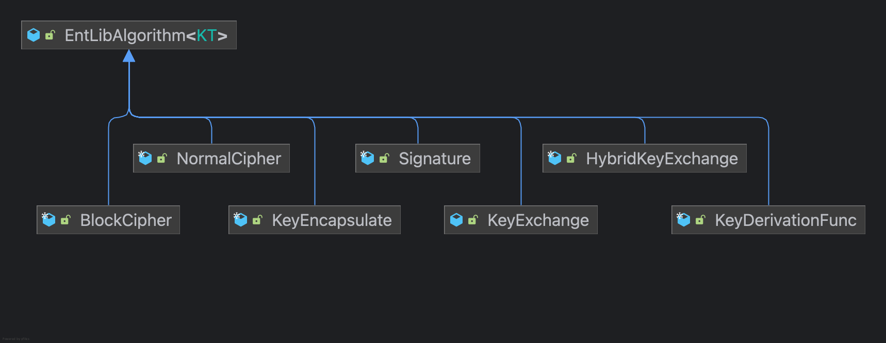

# Experimental Features Detail

해당 패키지의 기능들은 모두 `exp-sless-strategy-alg` 브랜치에서 선행 공개되며, 추가 검증을 통해 안정화된 이후 `1.1.0` 릴리즈에 포함됩니다.

전략적 패턴을 통해 강력하지만 효율적으로 보안 작업을 수행하기 위해 만들어졌습니다.

# Detail

기존 `entanglementlib.security.algorithm` 패키지에 수록된 클래스는 인스턴스에 특정 데이터를 보관합니다. 실제 안정적인 통신 및 암호화를 위해선 상태를 가지지 않은 객체를 통해 보안 작업을 수행해야 한다고 판단했습니다.

`EntLibAlgorithm` 클래스를 기준으로 다음의 다이어그램과 같은 관계를 가집니다.



`EntLibAlgorithm` 클래스는 `security.EntLibKey` 인터페이스를 제네릭 타입으로 전달받습니다. 전략 패턴을 통해 알고리즘을 사용할 때 해당 알고리즘이 사용하는 키 형식을 강제하기 위함입니다.

`experimental.security.builder` 패키지엔 개별 암호화 호출부 클래스에 부여될 수 있는 추가 설정을 위한 `builder` 패턴 형식의 클래스가 존재합니다. 블럭 암호화 알고리즘(block cipher)의 경우 다음과 같이 사용할 수 있습니다.

```java
import org.jetbrains.annotations.NotNull;
import space.qu4nt.entanglementlib.experimental.security.BlockCipher;
import space.qu4nt.entanglementlib.experimental.security.builder.AEADAdditional;
import space.qu4nt.entanglementlib.experimental.security.builder.blockcipher.BlockCipherSettingResult;
import space.qu4nt.entanglementlib.security.EntLibSecretKey;
import space.qu4nt.entanglementlib.security.algorithm.Mode;
import space.qu4nt.entanglementlib.security.algorithm.Padding;
import space.qu4nt.entanglementlib.util.wrapper.Hex;

import java.nio.charset.StandardCharsets;

class Main {
    void main() {
        BlockCipher aes256 = BlockCipher.AES256;

        // 대칭 키 생성
        EntLibSecretKey key = aes256.keyGen(/*Provider*/);

        // 블럭 암호화 설정
        BlockCipherSettingResult settingResult = aes256.blockCipherSetting()
                .mode(Mode.AEAD_CCM)
                .padding(Padding.NO)
                .iv(new byte[16])
                .done();

        // AAD 부여
        AEADAdditional aeadAdditional = AEADAdditional.builder()
                .aad("Awesome Data AAD".getBytes(StandardCharsets.UTF_8))
                .build();

        // 암호화 수행
        final byte @NotNull [] ciphertext = BlockCipher.blockCipherEncrypt(
                /*Provider*/ null,
                "Hello, Secure World!".getBytes(StandardCharsets.UTF_8),
                key,
                settingResult,
                aeadAdditional,
                0,
                null);

        System.out.println(Hex.toHexString(ciphertext)); // 출력: 암호문
    }
}
```

복호화도 일관된 로직을 통해 수행할 수 있습니다.

# And

정식 릴리즈 `1.1.0`에 포함되기 전에 아주 많은 수정 변경이 있을 예정입니다. 실제 암호화 부분은 팩토리 클래스를 통해 캡슐화되며, 세부적인 설정을 위해 빌더 패턴을 변경할 예정입니다.

또한 민감 데이터 소거 로직과 복사 로직을 강화하여 데이터를 안전하게 산출할 수 있도록 변경될 예정입니다.