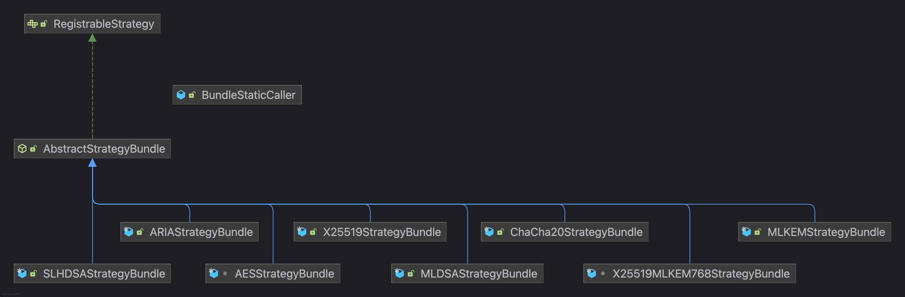
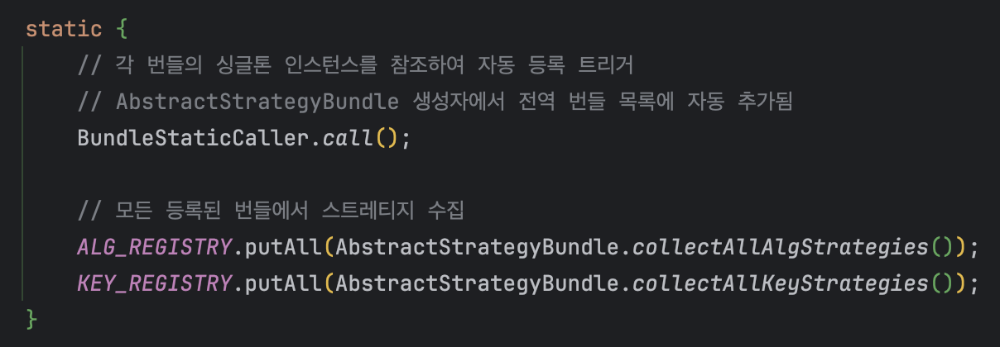
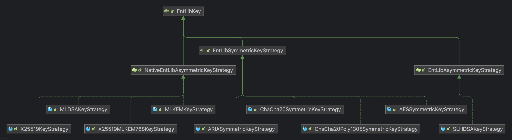
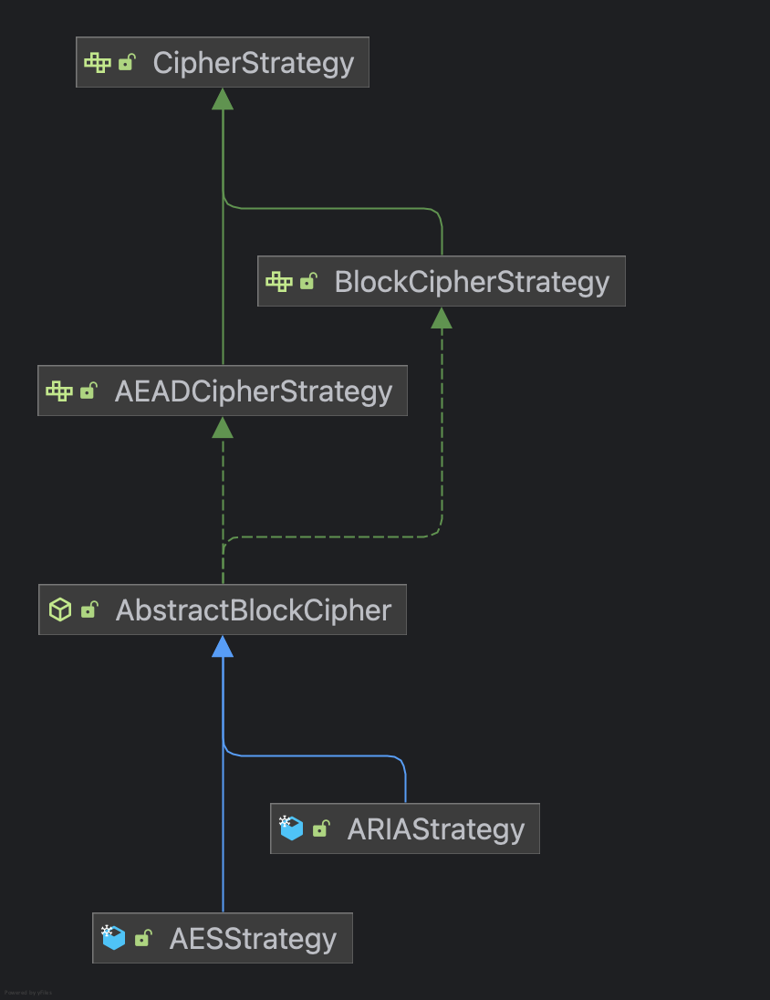

# Securirt Crypto: Strategy Pattern Overview

얽힘 라이브러리는 `1.1.0` 릴리즈부터 전략(strategy) 패턴을 통해 알고리즘을 사용할 수 있다. 이 문서는 전략 패턴을 통해 호출되는 개별 알고리즘의 작동 원리를 기술한다.

# 카테고리

암호화 알고리즘은 다음 카테고리를 가진다. 빗금 처리된 카테고리는 아직 구현된 알고리즘이 없음을 의미한다.

- Cipher(AEAD 가능)
	- Block Cipher
	- Stream Cipher
- Key Encapsulate Mechanism
- Digital Signature
- Key Establishment
	- Key Exchange
	- Key Agreement
- ~~Key Derivation Function~~

여기서 각 카테고리의 개념을 소개하지는 않겠다.

---

# 구현 구체화

얽힘 라이브러리에서 암호화는 전략적으로 구현되어 있다고 했다. 전략 패턴은 쉽게 부모와 자식 관계로 이루어진 객체 지향적인 패턴을 말한다. 모든 전략 구현체는 하나의 레지스트리에 등록되고, 외부에서 레지스트리로부터 특정 암호화 알고리즘과 알고리즘을 수행하기 위해 필요한 키를 호출 및 생성할 수 있다.

## 레지스트리

레지스트리 클래스는 `entanglementlib/security/crypto/EntLibCryptoRegistry.java` 클래스를 말한다.

> 이제부터 특별한 언급이 없는 이상 클래스의 네임스페이스에서 최상위 패키지를 가리키는 `entanglementlib/security/crypto/`와 확장자명은 생략하기로 약속한다. 이 패키지를 기준으로 상대 경로로 표현하겠다.

`EntLibCryptoRegistry` 클래스는 "팩토리(factory)" 패턴으로 이루어져 있다. 개별 전략 구현체는 이 클래스에 직접적으로 소속(상속 또는 일관된 상호 작용)하지 않는다.

구체적으로, 개별 전략 구현체는 각 알고리즘에 대응하는 번들(bundle) 클래스를 가지고 있고 개별 번들은 `AbstractStrategyBundle` 추상 클래스를 구현한다. 이 추상 클래스는 인스턴스 생성 시 추상 클래스의 '번들 전역 변수'에 담기게 되고, `#collectAllKeyStrategies()` 또는 `#collectAllAlgStrategies()` 정적 메소드를 레지스트리 클래스에서 호출하여 개별 번들의 키, 알고리즘 구현체를 수집하도록 설계되어있다.

> 번들 구현체가 만들어진 이유는 AES 알고리즘으로 예를 들어, 하나의 알고리즘이지만 세부적으로 `128`, `192`, `256`처럼 다양한 키 사이즈를 가질 수 있기 때문에 이러한 구현을 세분화하기 위해 마련됐다. ML-DSA 전자 서명 알고리즘의 경우는 `44`, `65`, `87` 파라미터 세트를 가지는 등, 매우 방대하다.

이해를 돕기 위해 모든 번들 구현체의 상속 구조를 다이어그램으로 나타냈다.

동떨어져있는 `bundle/BundleStaticCaller` 클래스는 모든 번들 구현체의 인스턴스를 생성하는 역할만 한다. 왜냐하면 모든 번들 구현체의 생성자는 `package-private`상태라서 외부 패키지에서는 호출이 불가능하기 때문이다(이 패턴은 추 후 JPMS를 통해 보완될 예정이다).

다음과 같이`bundle/BundleStaticCaller#call()` 정적 메소드를 레지스트리 클래스의 `static` 블럭에서 호출한다.

레지스트리 클래스의 정적 메소드인 `getAlgStrategy(...)`, `getKeyStrategy(...)` 를 통해 사용하고자 하는 알고리즘 전략 클래스를 다음과 같이 호출할 수 있다.
```java  
// AES-256 암호화 스트레티지 가져오기
CipherStrategy aesStrategy = EntLibCryptoRegistry.getAlgStrategy(CipherType.AES_256, CipherStrategy.class);  
  
// ML-DSA-44 서명 스트레티지 가져오기
NativeSignatureStrategy mldsaStrategy = EntLibCryptoRegistry.getAlgStrategy(SignatureType.ML_DSA_44, NativeSignatureStrategy.class);  
```
키 전략 패턴도 일관된 방식으로 호출할 수 있다.

구현체 클래스가 아닌 부모-레벨의 객체를 불러오는 이유는 기본적으로 '자체 캡슐화(self-encapsulation)' 패턴을 지향하기 때문이다. 라이브러리 자체는 캡슐화 되어있어도, 사용자의 환경에서 잘못 사용하는 경우 이 캡슐화가 깨질 수 있기 때문에 최대한 부모 레벨을 호출하여 유연하고 안전하게 사용하자는 일종의 '약속'인 것이다. 부모 객체의 자식(구현체)을 숨기기 위한 이유가 가장 우선적이다.

## 키 생성

암호화 알고리즘이 가질 수 있는 키는 매우 다양하다. 그 중에서도 "대칭 키(symmetric key; 비밀 키, secret key)"와 "비대칭 키(asymmetric key)"로 차별화할 수 있다. 비대칭 키는 "공개 키(public key)"와 "개인 키(private key)"로 이루어진 "키 페어(pair; 쌍)"로 산출된다. 키는 정말 다양한 방식으로 얻어낼 수 있다. 예를 들어, 키 유도 함수를 통해 키를 얻으면 그것이 비밀 키가 된다. 서로가 $100 + 200 \times 5$의 결과를 키라고 합의 한다면, 그것도 비밀 키가 된다.

얽힘 라이브러리는 사용하고자 하는 암호화 알고리즘에서 사용 가능한 키를 직관적으로 "객체"로 표현하기 위해 키 생성 패턴도 차별화했다. 알고리즘 구현체를 통해 키를 생성할 수 있도록 설계할 수도 있었지만, "키(즉, 민감 정보, sensitivity content 또는 data)"와 키를 통해 사용 가능한 "알고리즘"을 명확하게 분리함으로써 라이브러리의 캡슐화를 이루었다. 보통은 요리(암호화)에 필요한 재료(키)를 따로 준비하지, 요리에서 재료를 얻진 않으니까.

키 전략 구현체들의 상속 구조는 다음의 다이어그램으로 나타낼 수 있다.

전혀 복잡하지 않다. 아까부터 자주 보이는 `Native...` 는 해당 구현체의 연산이 `entlib-native` 라이브러리에서 이루어짐을 의미한다. 이에 관해선 후술할것이다. 어쨌든, `key/strategy/EntLibKey`인터페이스는 레지스트리 추상 클래스(`AbstractStrategyBundle`)에서 사용(호출)되는 마커 인터페이스(구현이 필요치 않으며, 단순히 확장 클래스를 포괄하여 호출하기 위한 객체 지향 패턴)이다.

다이어그램을 보면 상술했듯 크게 `Symmetric`, `Asymmetric`으로 이루어져 있는 것을 확인할 수 있다. 대칭 키는 대칭 키만의 생성 로직을 수행하는 것이고, 비대칭 키는 비대칭 키만의 생성 로직을 수행하는 것이다. 그 자식들(키 전략 구현체)은 자신이 대칭 키 또는 비대칭 키를 만들기 위해 어떤 작업을 수행해야 하는지 알고 있다.

대칭 키를 생성하는 구현체는 `key/strategy/EntLibSymmetricKeyStrategy#generateKey()` 메소드를, 비대칭 키를 생성하는 구현체는 `key/strategy/EntLibAsymmetricKeyStrategy#generateKeyPair()` 메소드를 사용하여 결과(키)를 얻을 수 있다.

## 민감 정보 컨테이너

암호화나 키 생성 구현을 기술하기 전에 한 가지 더 필요한 개념이 있다. 민감 정보 컨테이너(Sensitive Data Conatainer, SDC)는 보안이 중요시되는 데이터를 단순히 바이트 배열로 호출 또는 사용할 필요가 없도록 하기 위해 만들어졌다. 예를 들어 사용자가 키를 생성하거나, 평문을 필요로 하는 알고리즘에 '평문'을 안전하게 선언하고 전달하기 위함인 것이다. 암호화 결과가 암호문인 경우에 이 '암호문'도 민감 정보가 된다.

이 개념은 꽤 많은 배경 지식을 요구하기 때문에 이 문서에 독립적으로 기술되어야 할 개념은 아니다. 깊은 기술적 명세를 확인하고 싶다면 [이 곳](https://velog.io/@quant-t-f/entanglementlib-sdc)을 참고해라. 

그렇기 때문에 간결히 소개하자면, 민감 정보를 Java에서 받고, 네이티브(Rust)에서 사용하도록 한다. 이렇게 되면 이 정보를 더 이상 사용할 필요가 없을 때 네이티브에서 '매우 안전하게' 소거된다.

쉽게 말해 해당 민감 정보에 대한 '소유권(ownership)'을 완전히 얽힘 라이브러리에 귀속시키는 것이다. 얽힘 라이브러리가 민감 정보에 대해 소유권을 가질 수 없다면, 그 즉시 데이터를 파기(wipe, destroy; 영소거, zeroing)함으로서 전체적인 보안성을 유지시킨다. 사용자는 컨테이너 생성 시점에 민감 정보의 소유권을 넘겨줄지, 파기할지를 결정할 수 있다.

> 얽힘 라이브러리의 모든 로직에선 기본적으로 바이트 배열(`byte[]`)이 `Unsafe`하다고 예상한다.
> Java는 메모리 주소에 직접 접근하는 것을 방어하고,
> 얽힘 라이브러리는 메모리에 할당되는 행위 자체를 방어한다.

## 명세: BlockCipher

블럭 암호화 카테고리는 AES, ARIA 등 다양한 암호화 알고리즘을 일관된 인터페이스(`BlockCipherStrategy`)로 추상화한다. 내부적으로는 `BouncyCastle`의 저수준 API(`BlockCipher`, `BufferedBlockCipher`, `AEADBlockCipher`)를 래핑하여 구현되었으며, SDC와의 유기적인 통합을 통해 키(key) 및 평문(plaintext) 데이터의 메모리 잔존 위협을 원천 차단하는 것을 목표로 한다.

이 카테고리는 현재 다음의 알고리즘 구현체를 통해 사용할 수 있다.

1. AES
2. ARIA

상속 구조는 다음과 같다.


### 아키텍처 및 클래스 계층

시스템은 확장성과 유지보수성을 위해 다음과 같은 계층적 구조를 따른다.

#### 인터페이스 계층

 - **`EntLibCryptoStrategy`**: 모든 암호화 전략의 최상위 인터페이스로, 알고리즘 이름과 타입을 반환하는 메소드를 정의한다.
- **`CipherStrategy`**: 암호화(`encrypt`) 및 복호화(`decrypt`)의 핵심 동작을 정의하며, 초기화 벡터(Initialization Vector, IV) 설정 및 TLS 1.3 스타일의 Nonce 계산 로직을 포함한다.
- **`BlockCipherStrategy`**: `CipherStrategy`를 확장하여 블록 암호 특유의 설정인 **운영 모드(Mode)**, **패딩(Padding)**, **다이제스트(Digest)** 설정 메소드를 제공한다. 

#### 구현 계층

- **`AbstractBlockCipher`**: 블록 암호의 공통 로직을 처리하는 추상 클래스다. `BouncyCastle` 엔진의 초기화, 버퍼링된 암호(`BufferedBlockCipher`) 또는 `AEAD` 암호(`AEADBlockCipher`) 생성, 그리고 메모리 소거(`KeyDestroyHelper.zeroing`) 로직을 수행한다.
- **`AESStrategy`**: `AbstractBlockCipher`를 상속받은 구체 클래스(Concrete Class)로, `BouncyCastle`의 `AESEngine`을 사용하여 AES 알고리즘(128/192/256 bit)을 구현한다.

### 주요 기능 및 보안 메커니즘

#### 메모리 보안

이 카테고리는 `SensitiveDataContainer`를 입출력 타입으로 강제하거나 지원함으로써 힙(Heap) 메모리 내 민감 정보 노출을 방지한다.

- **Zero-Inference Rule:** 암호화/복호화 과정에서 SDC로부터 추출된 네이티브 데이터(byte array)는 연산 직후 `KeyDestroyHelper#zeroing`을 통해 즉시 덮어씌워진다.
- **Native Handling:** 키 데이터는 네이티브 메모리 세그먼트에서 관리되며, 사용 시점에만 일시적으로 힙으로 복사된 후 소거된다.

#### 운영 모드 및 패딩

`BlockCipherStrategy`는 `Mode`와 `Padding` 열거형(Enum)을 통해 다양한 암호화 구성을 지원한다.

- **지원 운영 모드 (`Mode`)**:
    - **Standard** 
	    - `ECB` (보안상 비권장)
	    - `CBC`
	    - `CFB`
	    - `OFB`
	    - `CTR`
    - **AEAD**
	    - `AEAD_GCM`
	    - `AEAD_CCM`
- **지원 패딩 (`Padding`)**:
    - `PKCS5`
    - `PKCS7`
    - `ISO7816`
    - `ISO10126`
    - `ZERO_BYTE`
    - `NO` (NoPadding)

#### IV 관리 및 체이닝

초기화 벡터(IV)의 생성, 검증, 그리고 전달 방식에 대해 엄격한 규칙을 적용한다.

- **IV 길이 검증:** AEAD 모드인 경우 12바이트, 일반 모드인 경우 16바이트의 IV 길이를 강제한다.
- **자동 생성 및 체이닝:** `encrypt` 수행 시 IV가 설정되지 않았다면 자동으로 생성하며, `ivChaining` 옵션이 `true`일 경우 결과 데이터의 앞부분에 IV를 연결($IV || CipherText$)하여 반환한다.
- **IV 추론 (Inference):** `decrypt` 수행 시 `ivInference`가 `true`라면, 암호문 앞단에서 규격에 맞는 IV를 자동으로 추출하여 복호화에 사용한다.

#### 인증된 암호화 (AEAD)

GCM 및 CCM 모드 사용 시 `AEADBlockCipher`를 통해 구현되며, 추가 인증 데이터(AAD)를 `updateAAD` 메소드로 설정할 수 있다.

### API 명세

#### 암호화 (Encrypt)

```java
SensitiveDataContainer encrypt(@NotNull SensitiveDataContainer keyContainer, final Object plain, boolean ivChaining)
```

- **설명**
	- 평문 데이터를 암호화한다. `keyContainer`는 암호화 키를 포함하며, `plain`은 `byte[]`, `SensitiveDataContainer`, 또는 `ByteBuffer` 타입이어야 한다.
- **IV 처리**
	- `ivChaining`이 `true`이고 ECB 모드가 아닌 경우, 반환되는 컨테이너의 데이터 구조는 $IV || EncryptedData$ 형태를 가진다.

#### 복호화 (Decrypt)

```java
SensitiveDataContainer decrypt(@NotNull SensitiveDataContainer keyContainer, final SensitiveDataContainer ciphertext, boolean ivInference)
```

- **설명**
	- 암호문 컨테이너를 복호화한다.
- **IV 추론**
	- `ivInference`가 `true`일 경우 암호문의 선두(12 또는 16바이트)를 잘라내어 IV로 사용한다. 반대로 `false`인 경우 사전에 `iv()` 메소드를 통해 설정된 값을 사용한다.

#### 블럭 암호화 구성 (Configuration)

- `setMode(Mode mode)`: 블록 암호 운영 모드 설정
- `setPadding(Padding padding)`: 패딩 방식 설정
- `iv(Object raw)`: 명시적 IV 설정 (`Integer` 입력 시 빈 SDC 생성, `byte[]` 또는 `SDC` 입력 시 값 설정)

## 명세: StreamCipher

스트림 암호화 카테고리는 ChaCha20와 같은 스트림 암호 알고리즘을 일관된 인터페이스(`StreamCipherStrategy`)로 추상화한다. 내부적으로는 `BouncyCastle`의 스트림 암호 엔진(`StreamCipher`, `ChaCha7539Engine`) 및 AEAD 엔진(`ChaCha20Poly1305`)을 래핑하여 구현되었으며, SDC와의 유기적인 통합을 통해 키(key) 및 평문(plaintext) 데이터의 메모리 잔존 위협을 원천 차단하는 것을 목표로 한다.

이 카테고리는 현재 다음의 알고리즘 구현체를 통해 사용할 수 있다.

1. ChaCha20 (IETF, [RFC 8439](https://datatracker.ietf.org/doc/html/rfc8439))
2. ChaCha20-Poly1305 (AEAD)

### 아키텍처 및 클래스 계층

시스템은 확장성과 유지보수성을 위해 다음과 같은 계층적 구조를 따른다.

#### 인터페이스 계층

- **`EntLibCryptoStrategy`**: 모든 암호화 전략의 최상위 인터페이스로, 알고리즘 이름과 타입을 반환하는 메소드를 정의한다.
- **`CipherStrategy`**: 암호화(`encrypt`) 및 복호화(`decrypt`)의 핵심 동작을 정의하며, IV 또는 Nonce 설정 및 TLS 1.3 스타일의 Nonce 계산 로직을 포함한다.
- **`StreamCipherStrategy`**: `CipherStrategy`를 확장하여 스트림 암호 및 AEAD 스트림 암호(Poly1305)를 위한 **AAD(Additional Authenticated Data)** 설정 메소드를 제공한다.

#### 구현 계층

- **`AbstractStreamCipher`**: 스트림 암호의 공통 로직을 처리하는 추상 클래스다. `BouncyCastle` 엔진의 초기화, 스트림 처리, 그리고 메모리 소거(`KeyDestroyHelper.zeroing`) 로직을 수행한다.
- **`ChaCha20Strategy`**: `AbstractStreamCipher`를 상속받은 구체 클래스(Concrete Class)로, `BouncyCastle`의 `ChaCha7539Engine`을 사용하여 IETF 표준 ChaCha20 알고리즘을 구현한다.
- **`ChaCha20Poly1305Strategy`**: `AbstractStreamCipher`를 상속받으며, 인증된 암호화(AEAD)를 위해 `ChaCha20Poly1305` 엔진을 사용하여 데이터 기밀성과 무결성을 동시에 보장한다.

### 주요 기능 및 보안 메커니즘

#### 메모리 보안

이 카테고리는 `SensitiveDataContainer`를 입출력 타입으로 강제하거나 지원함으로써 힙(Heap) 메모리 내 민감 정보 노출을 방지한다.

- **Zero-Inference Rule:** 암호화/복호화 과정에서 SDC로부터 추출된 네이티브 데이터(byte array)는 연산 직후 `KeyDestroyHelper#zeroing`을 통해 즉시 덮어씌워진다.
- **Native Handling:** 키 데이터는 네이티브 메모리 세그먼트에서 관리되며, 사용 시점에만 일시적으로 힙으로 복사된 후 소거된다.

#### IV(Nonce) 관리 및 체이닝

스트림 암호에서 필수적인 Nonce(IV)의 생성, 검증, 그리고 전달 방식에 대해 엄격한 규칙을 적용한다.

- **Nonce 길이 검증:** ChaCha20 및 ChaCha20-Poly1305 알고리즘 모두 IETF 표준에 따라 12바이트(96-bit)의 Nonce 길이를 강제한다.
- **자동 생성 및 체이닝:** `encrypt` 수행 시 Nonce가 설정되지 않았다면 자동으로 생성하며, `ivChaining` 옵션이 `true`일 경우 결과 데이터의 앞부분에 Nonce를 연결($Nonce || CipherText$)하여 반환한다.
- **IV 추론 (Inference):** `decrypt` 수행 시 `ivInference`가 `true`라면, 암호문 앞단(12바이트)에서 규격에 맞는 Nonce를 자동으로 추출하여 복호화에 사용한다.

#### 인증된 암호화 (AEAD)

`ChaCha20Poly1305Strategy` 사용 시 적용되며, 평문 데이터 암호화와 동시에 Poly1305 MAC(Message Authentication Code)을 생성한다. 추가 인증 데이터(AAD)는 `updateAAD` 메소드를 통해 설정할 수 있다.

### API 명세

#### 암호화 (Encrypt)

```java
SensitiveDataContainer encrypt(@NotNull SensitiveDataContainer keyContainer, final Object plain, boolean ivChaining)
```

- **설명**
    - 평문 데이터를 암호화한다. `keyContainer`는 암호화 키를 포함하며, `plain`은 `byte[]`, `SensitiveDataContainer`, 또는 `ByteBuffer` 타입이어야 한다.
- **IV 처리**
    - `ivChaining`이 `true`인 경우, 반환되는 컨테이너의 데이터 구조는 $Nonce || EncryptedData$ 형태를 가진다.

#### 복호화 (Decrypt)

```java
SensitiveDataContainer decrypt(@NotNull SensitiveDataContainer keyContainer, final SensitiveDataContainer ciphertext, boolean ivInference)
```

- **설명**
    - 암호문 컨테이너를 복호화한다.
- **IV 추론**
    - `ivInference`가 `true`일 경우 암호문의 선두(12바이트)를 잘라내어 Nonce로 사용한다. 반대로 `false`인 경우 사전에 `iv()` 메소드를 통해 설정된 값을 사용한다.

#### 스트림 암호화 구성 (Configuration)

- `iv(Object raw)`: 명시적 Nonce 설정 (`Integer` 입력 시 빈 SDC 생성, `byte[]` 또는 `SDC` 입력 시 값 설정)
- `updateAAD(byte[] aad)`: AEAD(Poly1305)를 위한 추가 인증 데이터(AAD) 설정

## 명세: KEM (Key Encapsulation Mechanism)

KEM(키 캡슐화 메커니즘) 카테고리는 공개 키 암호화 시스템을 사용하여 대칭 키(공유 비밀; Shared Secret, SS)를 안전하게 교환하기 위한 메커니즘을 정의한다. 얽힘 라이브러리(EntanglementLib)는 NIST가 표준화한 PQC 알고리즘인 **ML-KEM**을 중심으로, 고전적인 타원 곡선 알고리즘(**X25519**) 및 이 둘을 결합한 **하이브리드(Hybrid)** 방식을 지원한다.

모든 연산은 `NativeKEMStrategy` 인터페이스를 통해 추상화되며, 실제 암호학적 연산은 `entlib-native`의 Rust 코드로 위임되어 수행된다. 이는 고성능 연산과 함께 메모리 안전성을 보장하기 위함이다.

이 카테고리는 현재 다음의 알고리즘 구현체를 통해 사용할 수 있다.

1. **ML-KEM (Module-Lattice-based KEM)**: NIST FIPS 203 표준
    - `ML-KEM-512`
    - `ML-KEM-768`
    - `ML-KEM-1024`
2. **X25519**: `Curve25519` 기반의 고전적 KEM (ECDH)
3. **Hybrid**: X25519 + ML-KEM-768 결합 모드

### 아키텍처 및 클래스 계층

시스템은 PQC 전환기와 고전적 환경을 모두 지원하기 위해 유연한 계층 구조를 가진다.

#### 인터페이스 계층

- **`EntLibCryptoStrategy`**: 모든 암호화 전략의 최상위 인터페이스로, 알고리즘 식별을 담당한다.
- **`NativeKEMStrategy`**: 캡슐화(`encapsulate`) 및 디캡슐화(`decapsulate`)의 핵심 동작을 정의한다. 입출력 데이터는 반드시 `SensitiveDataContainer`를 통해 전달되어야 하며, 힙 메모리 노출을 최소화하도록 설계되었다.

#### 구현 계층

- **`MLKEMStrategy`**: `NativeKEMStrategy`를 구현한 클래스로, ML-KEM 알고리즘을 처리한다. `MLKEMStrategyBundle`을 통해 네이티브 핸들과 상호 작용하며, 파라미터 크기 검증 및 결과 컨테이너 바인딩(Binding)을 수행한다.
- **`MLKEMKeyStrategy`**: 비대칭 키 페어(공개 키, 개인 키) 생성을 담당한다. `NativeEntLibAsymmetricKeyStrategy`를 구현하며, 생성된 키는 즉시 네이티브 메모리에 할당된다.

### 주요 기능 및 보안 메커니즘

#### 메모리 보안 및 네이티브 위임

KEM 연산 과정에서 공유 비밀(Shared Secret)과 개인 키(Private Key)는 공격자에게 절대 노출되어서는 안 되는 가장 민감한 정보이다.

- **SDC 강제:** 모든 키와 결과값(공유 비밀, 암호문)은 `SensitiveDataContainer`에 저장된다.
- **Native Execution:** `encapsulate` 및 `decapsulate` 호출 시 JVM 힙이 아닌 네이티브 메모리 세그먼트의 포인터가 전달되며, 실제 연산은 `entlib-native` 라이브러리 내부에서 수행된다.
- **Zeroing:** 연산 중 발생한 임시 데이터나 에러 발생 시 생성된 컨테이너는 `close()`를 통해 즉시 소거(zeroize)된다.

#### 엄격한 파라미터 검증 (Rigorous Validation)

PQC 알고리즘은 키와 암호문의 크기가 고정되어 있으며, 이를 위반한 입력은 잠재적인 공격 시도로 간주된다.

- **Size Check:** `MLKEMStrategy`는 연산 수행 전 입력된 공개 키나 암호문의 바이트 크기가 `ParameterSizeDetail`에 정의된 규격과 정확히 일치하는지 검사한다. 일치하지 않을 경우 `EntLibCryptoKEMProcessingException` 또는 `EntLibSecurityError`를 발생시켜 연산을 중단한다.

#### 하이브리드 암호화 (Hybrid Cryptography)

`X25519MLKEM768` 타입은 고전 암호의 검증된 보안성과 PQC의 미래 보안성을 동시에 제공한다. 내부적으로 두 알고리즘의 키와 암호문을 결합(Concatenate)하여 처리하며, 파라미터 사이즈 또한 두 알고리즘의 합으로 계산된다.

### API 명세

#### 캡슐화 (Encapsulate)

```java
SensitiveDataContainer encapsulate(@NotNull SensitiveDataContainer keyPublic)
```

- **설명**
    - 수신자의 공개 키(`keyPublic`)를 사용하여 **공유 비밀(Shared Secret)**과 **암호문(Ciphertext)**을 생성한다.
- **동작**
    - `keyPublic`이 개인 키를 포함하지 않은 순수 공개 키 컨테이너라고 가정한다.
    - 반환되는 SDC는 **공유 비밀**을 담고 있으며, 하위 컨테이너(binding)로 **암호문**을 포함한다.

#### 디캡슐화 (Decapsulate)

```java
SensitiveDataContainer decapsulate(@NotNull SensitiveDataContainer secretKeyContainer, @NotNull SensitiveDataContainer ciphertext)
```

- **설명**
    - 수신자의 비밀 키(`secretKeyContainer`)와 수신된 암호문(`ciphertext`)을 사용하여 **공유 비밀(Shared Secret)**을 복원한다.
- **동작**
    - `secretKeyContainer`는 공개 키를 포함하지 않은 순수 비밀 키 컨테이너라고 가정한다.
    - 입력된 `ciphertext`의 크기를 검증한 후 네이티브 함수를 호출하여 공유 비밀을 복원하고 이를 SDC에 담아 반환한다.

#### 키 페어 생성 (Key Generation)

```java
Pair<SensitiveDataContainer, SensitiveDataContainer> generateKeyPair()
```

- **설명**
    - 선택된 알고리즘(`KEMType`)에 맞는 공개 키와 비밀 키 쌍을 생성한다.
- **반환**
    - `Pair<PublicKey, PrivateKey>` 형태의 SDC 쌍을 반환한다. 각 키는 네이티브 메모리에 안전하게 할당된다.